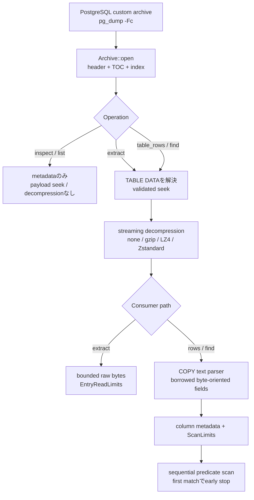

# pgdumpx

**PostgreSQL Custom Formatをrestoreせず、byte-orientedなrowとして安全にscanするRustライブラリ / CLI。**

> ステータス: v0.1の実装とrelease-readiness作業は完了しています。v0.2は[Tracking Issue #56](https://github.com/tappe9/pgdumpx/issues/56)で計画済みですが、v0.2のproduction codeはまだ`main`へmergeされていません。crate / CLIの公開releaseもまだ行っていません。

pgdumpxは、PostgreSQL Custom Format (`pg_dump -Fc`) archiveを、データベースへrestoreせずに検査するread-onlyのRustライブラリ / CLIです。

価値の中心は、単にarchive entryを開くことではありません。TOCから対象table-data entryを選択し、offsetへseekし、streaming decompressionし、PostgreSQL `COPY` textをlogicalなrow / fieldとしてparseし、application-defined predicateに一致した最初のrowで処理を停止できる一連の経路を提供します。

代表的なユースケースは次です。

> 大きな`-Fc` backupから、PostgreSQLを起動せず、対象テーブル全体をメモリへ載せずに、特定の受注・ユーザーなど1件を探す。

[English README](README.md)

## 現在の開発状況

- **`main`で実装済み:** metadata inspection、4種類のcompression backend、bounded raw extraction、COPY row parsing、first-match search、各種limits、fuzz / benchmark / CI evidence、rustdoc、packaging / release-readiness verificationを含むv0.1全体。
- **次に実装するv0.2:** file-oriented convenience API ([#57](https://github.com/tappe9/pgdumpx/issues/57))、owned byte-oriented table selector ([#58](https://github.com/tappe9/pgdumpx/issues/58))、reusable extraction plan ([#59](https://github.com/tappe9/pgdumpx/issues/59))をfoundationとし、sequential multi-table executionとselection helperを[#60](https://github.com/tappe9/pgdumpx/issues/60)〜[#62](https://github.com/tappe9/pgdumpx/issues/62)で追加する計画です。
- **activeなv0.2実装範囲から明示的に除外:** parallel extraction、sidecar index / restart-point scheme、data-only archive identity support、v0.3以降のdata ecosystem integration。

実装順と依存関係は[ROADMAP.md](ROADMAP.md)を参照してください。

## pgdumpxが解決すること

PostgreSQL Custom FormatにはTOCとentry単位のdata positionがあります。そのため対象**entry**へ選択的にアクセスできますが、列値からrow位置を引くrow-level indexは含まれていません。

pgdumpxはarchive layerとrow layerを、resource-boundedな1本のinspection pathとして構成します。



v0.1では次を重視します。

- PostgreSQL Custom Format (`-Fc`) の**read-only parser**
- 実行時にPostgreSQL server、`libpq`、`pg_restore`を必要としない構成
- `Read + Seek`による**lazy entry access**
- テーブル全体を保持しない**streaming decompression**
- 通常のpg_dump `COPY` textをrow / fieldとして扱うAPI
- UTF-8やrowごとのowned allocationを前提にしない**borrowed row / byte-oriented field API**
- SQL parserを導入しない**column-aware first-match filtering**
- location contextを持つtyped error
- structural、row scan、raw extractionを分けたresource limits
- CLIや将来のlanguage/data integrationから再利用できる小さなCore
- official fixtureで裏付けた互換性と、再現可能なbenchmark methodology

`Pure Rust`という言葉を、全transitive dependencyに対する包括的な保証としては使用しません。default buildはPostgreSQL runtime componentから独立しており、compression backendやnative build上の制約は個別に文書化しています。詳細は[ADR 0007](docs/adr/0007-standalone-row-scanner-and-vertical-slices.md)と[Packaging and dependency constraints](docs/PACKAGING.md)を参照してください。

## 想定ユースケース

PostgreSQL dumpをrestore専用ファイルではなく、offline data sourceとして扱いたい場面を対象にします。

- PostgreSQL serverを起動せずに本番backupを調査する
- 大きなCustom Format dumpから特定の受注・ユーザーなど1件を探す
- archive全payloadをメモリへ読み込まずに1つのtable-data streamを抽出する
- backup verification、障害調査、support / forensics向けツールを作る
- 顧客や外部から受領したdumpを明示的なparser / work budgetの下で解析する
- 選択したrow streamをCSV、JSON Lines、Arrow、Parquet等へ変換する
- Rust coreを共通基盤としてCLIや将来のPython bindingを構築する

## v0.1の対象

v0.1はPostgreSQL Custom Formatだけを対象にします。

```bash
pg_dump -Fc mydb > backup.dump
```

実装済みのv0.1互換範囲はArchive Format Version **1.14〜1.16**と、次のcompressionです。

- none
- gzip
- LZ4
- Zstandard

older archive versionについて、すべてのbackendのfixtureが存在するとは限らないため、fixture-backed verificationは意図的により狭く記述しています。version / compressionごとの正確なevidence matrixは[docs/COMPATIBILITY.md](docs/COMPATIBILITY.md)を参照してください。そこに記載するclaimはofficial PostgreSQL-generated fixtureとproduction-path differential checkで裏付けた範囲に限定します。

row-aware APIが対象にするのは、通常のpg_dumpが生成するPostgreSQL `COPY` text形式のtable dataです。次はv0.1 row parserの対象外です。

- `--inserts`
- `--column-inserts`
- `--rows-per-insert`によるINSERT output
- Binary COPY

unsupported representationはCOPY textとして推測せず、row APIからtyped errorで失敗させます。archive entry自体が読める場合はraw extractionを利用できる可能性があります。

## Rust API

v0.1 libraryではmetadata inspection、selected-entry streaming、COPY row access、first-match search、structural / scan / raw-extraction limits、contextual typed error、4種類の対応compression backendを実装済みです。

```rust
use pgdumpx::{Archive, FieldRef};

let file = std::fs::File::open("backup.dump")?;
let mut archive = Archive::open(file)?;

println!("archive version: {:?}", archive.header().version());

for entry in archive.entries() {
    println!("{entry:?}");
}

let mut rows = archive.table_rows(b"public", b"orders")?;
while let Some(row) = rows.next_row()? {
    println!("{:?}", row);
}
```

`next_row(&mut self)`を通常の`Iterator`にしないのは意図的です。borrowed `Row`は再利用可能な内部storageを参照し、次のmutable reader operationまでだけ有効です。

明示的なtotal-work budgetの下で、最初に一致する1行を取得できます。

```rust
use pgdumpx::ScanLimits;

let mut rows = archive.table_rows(b"public", b"orders")?;
let order_number = rows
    .column_index(b"order_number")?
    .ok_or(/* application error */)?;

let scan_limits = ScanLimits::unlimited()
    .with_max_rows(100_000)
    .with_max_decompressed_bytes(64 * 1024 * 1024);

let row = rows.find_first_with_limits(scan_limits, |row| {
    row.field(order_number) == Some(FieldRef::Bytes(b"123456"))
})?;
```

`find_first`は追加のoperation-level scan budgetを適用しないconvenience pathです。`find_first_with_limits`は同じstreaming parser / predicate loopへ`ScanLimits`を適用します。

`column_index()`は次を区別します。

```text
Ok(Some(index))  metadataが正常でcolumnが見つかった
Ok(None)         metadataは正常だがrequested columnが存在しない
Err(...)         column layoutを利用できない、またはmalformed
```

どちらのfirst-match methodもDBのindex lookupではなく**streaming sequential scan**です。TOCによって対象table-data entryへ直接seekできますが、entry内のrowは先頭または現在のstream positionから順番にdecompress / parseします。早い位置で一致すれば即終了できますが、late matchやno matchでは、configured budgetが停止させない限り対象entry全体を処理する可能性があります。unrestrictedなworst case workはselected table-data streamの大きさに比例します。

APIでは次を別のlimitとして扱います。

- structural / per-item limits
- row scan全体のwork limits
- raw entry extractionのdecompressed-byte limit

`Limits::default()`はfiniteなcompatibility-oriented defaultで、`Archive::open_with_limits`ではTOC / string / dependency / row / fieldへより厳しいlimitを指定できます。`ScanLimits::default()`と`ScanLimits::unlimited()`はoperation-levelの2つのoptional budgetを未設定にします。`max_rows = N`では、一致rowを含めて最大`N`件のcomplete rowだけをyield / evaluateできます。decompressed-byte budgetは、field separator、row terminator、escape spelling、消費したCOPY terminatorを含む、parserが消費した物理COPY byteを数えます。logical fieldのdecode後lengthや、decoder / `BufRead`が先読みした未消費byteは数えません。budgetをcrossするrowはyieldもpredicate評価もされず、limit / consumed-work contextを持つtyped resource errorを返します。

詳細は[Public API design](docs/API-DESIGN.md)とcrate rustdocを参照してください。

## CLI

`inspect`、`list`、`extract`、`find`は実装済みで、archive / COPY parserをCLI側へ重複実装せずpublic Rust APIを利用します。

```bash
pgdumpx inspect backup.dump
pgdumpx list backup.dump
pgdumpx extract backup.dump public.orders
pgdumpx extract --max-decompressed-bytes 2147483648 backup.dump public.orders
pgdumpx find backup.dump public.orders order_number 123456
pgdumpx find --max-rows 100000 --max-decompressed-bytes 67108864 \
  backup.dump public.orders order_number 123456
```

table-oriented commandの`<SCHEMA.TABLE>`はASCIIの`.`をちょうど1個含み、schema / tableの両componentをnon-emptyとします。SQL identifierのquote / escapeや`.`を含むidentifierはv0.1 CLIでは未対応です。CLI境界のquery identifier / valueはUTF-8で、Rust APIはbyte-orientedのままです。

### `inspect` / `list`

`inspect <FILE>`はarchive version、compression、entry / table / table-data件数をdeterministicな`key=value`形式で表示します。`list <FILE>`はTOC orderを維持し、dump ID、object type、schema、nameをtab区切りで表示します。どちらもlibraryのmetadata-open pathだけを使い、`TABLE DATA` payloadへのseek、entry decompression、COPY row parserには到達しません。diagnosticはstderrへ出力し、malformed archiveはnon-zero exitになります。

### `extract`

```text
pgdumpx extract [--max-decompressed-bytes <N>] <FILE> <SCHEMA.TABLE>
```

選択したentryの**decompressed table-data body**をbinary-safeなbytesとしてstdoutへ出力します。schema DDL、`COPY` statement wrapper、restore可能な完全SQLは追加しません。

CLIはlibraryのbounded raw-extraction pathを利用します。option省略時のfinite defaultは**1,073,741,824 bytes (1 GiB)**です。明示overrideは正の10進`u64`で、`<FILE>`より前に指定します。malformed / zero / overflow / duplicate / unknown limit optionはusage errorです。

limit到達はsuccessful truncationではなくerrorです。stdoutはstreaming出力なので、後続のlimit / decompression / input / destination errorより前に書き込んだbyteはrollbackできません。そのためpartial bytesがstdoutから観測できる場合でもprocessはnon-successで終了し、diagnosticはstderrへ出力します。consumerはoutput lengthではなくexit statusで正常完了を判定してください。詳細は[Bounded raw entry extraction](docs/RAW-EXTRACTION.md)を参照してください。

### `find`

```text
pgdumpx find [--unlimited | [--max-rows <N>] [--max-decompressed-bytes <N>]] \
  <FILE> <SCHEMA.TABLE> <COLUMN> <VALUE>
```

optionalなfinite scan-limit flagはそれぞれ正の10進`u64`を1回まで指定でき、`<FILE>`より前に置きます。option未指定時は、**complete row 100,000件**と**parser-consumed decompressed bytes 67,108,864 bytes (64 MiB)**のinclusiveなdefaultを両方適用します。finite optionを片方だけ指定した場合はその次元だけを上書きし、もう一方のfinite defaultは残ります。trusted workflowでは`--unlimited`により両方のtotal-work budgetを明示的に解除できますが、finite optionとは排他的です。`--max-rows <N>`はlibrary search pathがevaluateしたcomplete rowを数え、一致rowも含みます。`--max-decompressed-bytes <N>`はparser-consumed physical COPY-byte会計を使い、separator、row terminator、escape spelling、消費したCOPY terminatorを含みますが、decompressor / bufferの未消費lookaheadやlogical decodeによるlength変化は含みません。数値の根拠、exact boundary、移行手順は[`find` scan-budget policy](docs/FIND-SCAN-LIMITS.md)を参照してください。

一致時はstdoutへ**正規化したCOPY text 1 record**だけを出力します。fieldはCOPY column順のASCII tab区切りで、record末尾はLFです。NULLは`\N`、empty bytesはempty fieldです。backslash / tab / LF / CRは`\\` / `\t` / `\n` / `\r`、その他のnon-printableまたはnon-ASCII byteは`\377`のような3桁octal escapeで出力します。lossy UTF-8変換を行わず、stdoutをdeterministicかつASCII-safeに保ちます。no matchでは何も出力せず、diagnosticはstderrだけへ出力します。

resource limit到達はclean no-matchではなくoperation failureです。一致rowへ到達する前にbudgetを使い切った場合もstderrへdiagnosticを出し、`2`で終了します。

stable exit behavior:

```text
0  match found
1  scan完了、matching rowなし
2  usage / I/O / format / integrity / decompression / COPY / encoding /
   unsupported representation / unknown column / resource error
```

## Architecture

archive openではmetadataとTOC indexだけを構築し、payloadはlazyに読みます。

```text
Archive<R: Read + Seek>
        │
        ├── header + TOC parser
        ├── ArchiveIndex
        └── on-demand validated seek
                  │
                  ▼
          EntryDataReader
                  │
          streaming decompression
                  │
                  ▼
          COPY text row reader
                  │
                  ├── row iteration
                  └── first-match filtering
```

byte-oriented metadata、integrity check、resource accounting、row-parser errorを1つのmodelで扱えるよう、狭いstandalone read pathを実装しています。関連dump libraryはresearch referenceやdifferential test comparatorとして利用できます。

詳細は[ARCHITECTURE.md](ARCHITECTURE.md)を参照してください。

## COPY text contract

`FieldRef::Bytes`はarchive上のescaped spellingではなく、**PostgreSQL COPY text escape decode後のlogical field bytes**を表します。`\N`は`FieldRef::Null`、空の非NULL fieldは長さ0のbytesです。

row framing、escape、column metadata、unsupported representation、resource limitsは[docs/COPY-TEXT.md](docs/COPY-TEXT.md)で定義します。

## Evidence policy

compatibility / performance claimにはevidenceが必要です。

valid archive fixtureではofficial `pg_dump` generator version、exact generation command、archive-format version / compression、checksum、purpose、expected objectを記録します。committed evidence matrixは[docs/COMPATIBILITY.md](docs/COMPATIBILITY.md)で管理します。

benchmark harnessはdataset / generator、command/API path、hardware/OS、exact commit、compression、match position、measurement tool、warm-up/repetition methodを記録します。このREADMEでは、再現可能なrecorded resultに紐づかない定量的なthroughput / latency / peak-memory / competitor-speedup claimを意図的に行っていません。詳細は[benchmarks/README.md](benchmarks/README.md)を参照してください。

v0.1の最終Definition of Done evidence mappingは[docs/V0.1-RELEASE-AUDIT.md](docs/V0.1-RELEASE-AUDIT.md)に記録しています。

## Related projects

- [`libpgdump`](https://github.com/gmr/libpgdump) — PostgreSQL custom / directory / tar dumpをread/writeするRust library
- [`pgdumplib`](https://github.com/gmr/pgdumplib) — PostgreSQL custom-format dumpをread/writeするPython library

これらは隣接するPostgreSQL dump use caseを扱います。pgdumpxはCustom Format archiveに対するread-only / bounded / byte-oriented row inspectionへ意図的にscopeを絞っています。

## Documentation map

各documentのprimary responsibilityを分け、重複とdriftを抑えます。

- [README](README.md) / [日本語 README](README.ja.md) — product value、現在の実装/release status、example、high-level scope
- [Requirements](docs/REQUIREMENTS.md) — normative v0.1 behaviorとDefinition of Done
- [Architecture](ARCHITECTURE.md) — 実装済みboundaryとdata flow
- [Public API design](docs/API-DESIGN.md) — 実装済みRust API semanticsとownership/resource contract
- [Custom archive format notes](docs/PG-DUMP-CUSTOM-FORMAT.md) — upstream-derived archive behavior
- [COPY text contract](docs/COPY-TEXT.md) — row / field byte semantics
- [Compatibility matrix](docs/COMPATIBILITY.md) — targetとfixture-verified supportの区別
- [Bounded raw extraction](docs/RAW-EXTRACTION.md) — raw byte-budget / partial-output semantics
- [`find` scan-budget policy](docs/FIND-SCAN-LIMITS.md) — finite CLI default、根拠、boundary、migration guidance
- [Packaging audit](docs/PACKAGING.md) — package/license/runtime dependency boundary
- [v0.1 release audit](docs/V0.1-RELEASE-AUDIT.md) — 最終DoD-to-evidence mapping
- [Roadmap](ROADMAP.md) — delivered v0.1 slice、planned v0.2 issue sequence、later candidate scope
- [Architecture Decision Records](docs/adr/) — accepted / superseded design decisions
- [Contributing](CONTRIBUTING.md) — contribution / document-update policy
- [Security policy](SECURITY.md) — vulnerability reporting / resource-threat model

## Licensing

pgdumpxは次のいずれかのlicenseを選択できます。

- Apache License, Version 2.0
- MIT License

詳細は[LICENSE-APACHE](LICENSE-APACHE)と[LICENSE-MIT](LICENSE-MIT)を参照してください。
