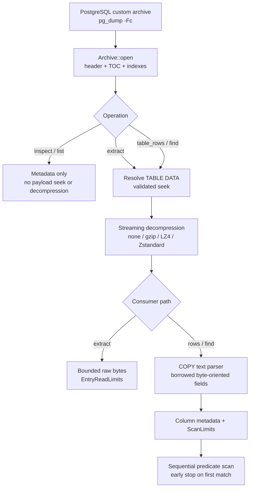

# pgdumpx

[](https://crates.io/crates/pgdumpx)
[](https://docs.rs/pgdumpx/0.2.0/pgdumpx/)
[](https://github.com/tappe9/pgdumpx/actions/workflows/ci.yml)
[](https://www.rust-lang.org/)
[](LICENSE-MIT)

**A bounded, byte-oriented row scanner for PostgreSQL custom-format dumps.**

> `pgdumpx 0.2.0` is published on crates.io as both a reusable Rust library and an installable CLI package.

pgdumpx is a read-only Rust library and CLI for inspecting PostgreSQL custom-format (`pg_dump -Fc`) archives without restoring them into a database.

Its primary value is not merely opening an archive entry. pgdumpx selects one table-data entry through the archive TOC, seeks to it, streams decompression, parses PostgreSQL `COPY` text into logical rows and fields, evaluates an application-defined predicate, and can stop as soon as the first matching row is found.

A representative use case is:

> Find one order, user, or other record in a large `-Fc` backup without starting PostgreSQL and without buffering the complete table.

[日本語 README](README.ja.md)

## Published artifacts

| Artifact | Version | Purpose |
| --- | --- | --- |
| [`pgdumpx`](https://crates.io/crates/pgdumpx/0.2.0) | `0.2.0` | Reusable Rust library |
| [`pgdumpx-cli`](https://crates.io/crates/pgdumpx-cli/0.2.0) | `0.2.0` | Installs the `pgdumpx` executable |
| [API documentation](https://docs.rs/pgdumpx/0.2.0/pgdumpx/) | `0.2.0` | Published library rustdoc |
| [GitHub Release](https://github.com/tappe9/pgdumpx/releases/tag/v0.2.0) | `v0.2.0` | Source release and release notes |

## Current development status

- **v0.2.0 published:** the library, CLI package, annotated source tag, GitHub Release, and API documentation are available from the links above.
- **v0.1 foundation completed:** metadata inspection, four compression backends, bounded raw extraction, COPY row parsing, first-match search, limits, fuzz/benchmark/CI evidence, rustdoc, and packaging verification.
- **v0.2 completed:** file-oriented opening, owned byte-oriented selectors, reusable extraction plans, deterministic sequential multi-table extraction, metadata filtering, and exact named-column equality helpers are implemented.
- **Correctness and maintenance follow-ups completed:** destination flush failures, aggregate metadata budgets, terminal row-reader errors, field-count validation, linear duplicate detection, finite CLI scan defaults, feature-matrix testing, scheduled fuzzing, advisory policy, and workflow hardening are included in the current source.
- **v0.3+ candidates remain deferred:** parallel extraction, sidecar indexes/restart-point schemes, data-only archive identity support, and data-ecosystem integrations are not active commitments.

See [ROADMAP.md](ROADMAP.md) for delivery order and dependency boundaries.

## Why pgdumpx?

A PostgreSQL custom archive contains a table of contents (TOC) and per-entry data positions. That makes selective **entry** access possible, but it does not provide a row-level value index.

pgdumpx composes the archive and row layers into one bounded inspection path:



The implemented design emphasizes:

- **read-only parsing** of PostgreSQL Custom Format archives;
- no running PostgreSQL server, `libpq`, or `pg_restore` requirement at runtime;
- **lazy entry access** using `Read + Seek`;
- **streaming decompression** without buffering an entire table;
- **row-aware parsing** of normal pg_dump `COPY` text data;
- **borrowed rows and byte-oriented fields** without requiring UTF-8 or per-row ownership;
- **column-aware first-match filtering** without a SQL parser;
- typed, location-aware errors;
- structural, row-scan, and raw-extraction resource limits;
- a small core suitable for CLI and later language/data integrations;
- fixture-backed compatibility and reproducible benchmark methodology.

The project does not use “Pure Rust” as a blanket dependency guarantee. The default build remains independent of PostgreSQL runtime components; compression backend and native-build implications are documented separately. See [ADR 0007](docs/adr/0007-standalone-row-scanner-and-vertical-slices.md) and [Packaging and dependency constraints](docs/PACKAGING.md).

## Use cases

pgdumpx targets situations where a PostgreSQL dump is useful as an offline data source rather than only as restore input:

- inspect a production backup without starting PostgreSQL;
- find one record inside a large custom-format dump;
- extract one selected table-data stream without reading every payload into memory;
- build backup verification and support/forensics tools;
- process customer-supplied dumps under explicit parser and work budgets;
- convert selected row streams into CSV, JSON Lines, Arrow, or Parquet in downstream tools;
- build Rust, CLI, Python, or analytical tooling on one reusable row-scanning core.

## Supported scope

pgdumpx targets PostgreSQL Custom Format only:

```bash
pg_dump -Fc mydb > backup.dump
```

The implemented compatibility range is archive format versions **1.14 through 1.16** with:

- none;
- gzip;
- LZ4;
- Zstandard.

Fixture-backed verification is deliberately narrower where an older archive version does not have a committed fixture for every backend. The exact version/compression evidence matrix lives in [docs/COMPATIBILITY.md](docs/COMPATIBILITY.md); claims there are backed by official PostgreSQL-generated fixtures and production-path differential checks.

Row-aware access targets normal pg_dump table data represented as PostgreSQL `COPY` text. The following are explicitly outside the row parser:

- `--inserts`;
- `--column-inserts`;
- INSERT output produced by `--rows-per-insert`;
- Binary COPY.

Unsupported logical representations fail through a typed row-API error rather than being guessed as COPY text. Raw entry extraction may still be available when the archive entry itself is structurally readable.

## v0.2 library additions

- `Archive::open_path` and `Archive::open_path_with_limits` provide file-oriented opening while delegating to the same generic `Read + Seek` parser.
- `TableSelector` owns exact schema and table-name bytes and can be reused across archives.
- `ExtractionPlan` stores ordered selectors and `EntryReadLimits`. It completes metadata-only preflight for every target before requesting a destination, then executes bounded raw extraction sequentially in deterministic selector order.
- Multi-table execution keeps one mutable seekable source. It does not open a second handle or claim concurrent extraction.
- Completed targets remain reported if a later target fails. The current destination may already contain partial bytes, and a destination `flush` failure is returned as an output error rather than successful completion.
- `MetadataFilter` matches already-parsed TOC metadata by exact schema, object type, and name without reading payloads. An absent namespace is distinct from a present empty namespace.
- `TableRowReader` provides `find_first_equal` and `find_first_equal_with_limits`; both resolve one column once and compare exact logical COPY bytes. SQL NULL, empty bytes, and literal `b"\\N"` bytes remain distinct.

All row searches remain sequential scans. The helpers add reusable selection policy, not a row-level index.

## Installation

### CLI from crates.io

```bash
cargo install pgdumpx-cli --version 0.2.0 --locked
pgdumpx --version
pgdumpx --help
```

The package name is `pgdumpx-cli`; the installed executable is named `pgdumpx`.

### Library from crates.io

```toml
[dependencies]
pgdumpx = "0.2.0"
```

Published API documentation is available on [docs.rs](https://docs.rs/pgdumpx/0.2.0/pgdumpx/). Registry metadata can also be inspected with:

```bash
cargo info pgdumpx@0.2.0
cargo info pgdumpx-cli@0.2.0
```

### From source

Use the source path to test the current `main` branch or local changes:

```bash
git clone https://github.com/tappe9/pgdumpx.git
cd pgdumpx
cargo install --path crates/pgdumpx-cli --locked
pgdumpx --help
```

## Rust API

The library implements metadata inspection, selected-entry streaming, COPY row access, reusable extraction policy, exact equality search, structural/scan/raw-extraction limits, contextual typed errors, and all four supported compression backends.

```rust
use pgdumpx::{Archive, ColumnEqualityResult, FieldRef, ScanLimits};

fn main() -> Result<(), Box<dyn std::error::Error>> {
    let mut archive = Archive::open_path("backup.dump")?;
    let mut rows = archive.table_rows(b"public", b"orders")?;
    let scan_limits = ScanLimits::unlimited()
        .with_max_rows(100_000)
        .with_max_decompressed_bytes(64 * 1024 * 1024);

    let result = rows.find_first_equal_with_limits(
        scan_limits,
        b"order_number",
        FieldRef::Bytes(b"123456"),
    )?;

    if let ColumnEqualityResult::Match(row) = result {
        println!("{row:?}");
    }

    Ok(())
}
```

`next_row(&mut self)` is intentionally not a normal `Iterator` method: each borrowed `Row` references reusable internal storage and remains valid only until the next mutable reader operation. `find_first` / `find_first_with_limits` retain the generic predicate path; the equality helpers delegate to that same scan.

Column lookup distinguishes three states:

```text
Ok(Some(index))  valid metadata, column found
Ok(None)         valid metadata, requested column absent
Err(...)         column layout unavailable or malformed
```

Both first-match methods perform a **streaming sequential scan**, not a database index lookup. The TOC enables direct access to the selected table-data entry, but rows are decompressed and parsed in order from the beginning/current stream position. A match can stop early; an absent or late match may process the complete selected table unless a configured budget ends the operation. Worst-case unrestricted work is proportional to the selected table-data stream.

The API keeps three resource concepts separate:

- structural/per-item limits;
- total row-scan work limits;
- decompressed-byte limits for raw entry extraction.

`Limits::default()` is finite and compatibility-oriented, and `Archive::open_with_limits` accepts stricter caller-selected TOC/string/dependency/row/field bounds. `ScanLimits::default()` and `ScanLimits::unlimited()` leave both operation-level budgets unset. `max_rows = N` permits at most `N` complete rows to be yielded or evaluated, including a matching row. The decompressed-byte scan budget counts physical COPY bytes consumed by the parser—including field separators, row terminators, escape spellings, and the COPY terminator when consumed—not logical decoded field length or unread decoder/`BufRead` lookahead. A crossing row is not yielded or passed to the predicate, and exhaustion is returned as a typed resource error with limit and consumed-work context.

See [Public API design](docs/API-DESIGN.md) and the [published crate documentation](https://docs.rs/pgdumpx/0.2.0/pgdumpx/) for the complete public contract.

## CLI

`inspect`, `list`, `extract`, and `find` are implemented and use the public Rust library path rather than maintaining separate archive or COPY parsers.

```bash
pgdumpx inspect backup.dump
pgdumpx list backup.dump
pgdumpx extract backup.dump public.orders
pgdumpx extract --max-decompressed-bytes 2147483648 backup.dump public.orders
pgdumpx find backup.dump public.orders order_number 123456
pgdumpx find --max-rows 100000 --max-decompressed-bytes 67108864 \
  backup.dump public.orders order_number 123456
```

For table-oriented commands, `<SCHEMA.TABLE>` contains exactly one ASCII `.` separator and non-empty schema and table components. SQL identifier quoting/escaping and identifiers containing `.` are not supported by the current CLI grammar. Query identifiers/values at the CLI boundary are UTF-8; the Rust API remains byte-oriented.

### `inspect` / `list`

`inspect <FILE>` prints archive version, compression, and entry/table/table-data counts as deterministic `key=value` lines. `list <FILE>` prints TOC entries in archive order as tab-separated dump ID, object type, schema, and name columns. Both commands stop at the library metadata-open path: they do not seek into `TABLE DATA` payloads, decompress entry data, or invoke the COPY row parser. Diagnostics are written to stderr and malformed archives exit non-zero.

### `extract`

```text
pgdumpx extract [--max-decompressed-bytes <N>] <FILE> <SCHEMA.TABLE>
```

`extract` writes the selected entry's **decompressed table-data body** to stdout as binary-safe bytes. It does not add schema DDL, a `COPY` statement wrapper, or a complete restorable SQL script.

The command uses the library's bounded raw-extraction path. When the option is omitted, the finite default is **1,073,741,824 bytes (1 GiB)**. An explicit override must be a positive decimal `u64` and must appear before `<FILE>`; malformed, zero, overflowing, duplicate, or unknown limit options are usage errors.

Limit exhaustion is an error, not successful truncation. Because output is streamed, bytes already written before a later limit, decompression, input, or destination error cannot be rolled back. Partial bytes can therefore be observable on stdout even though the command exits non-successfully; diagnostics remain on stderr. Consumers must use the exit status to decide whether extraction completed successfully. See [Bounded raw entry extraction](docs/RAW-EXTRACTION.md).

### `find`

```text
pgdumpx find [--unlimited | [--max-rows <N>] [--max-decompressed-bytes <N>]] \
  <FILE> <SCHEMA.TABLE> <COLUMN> <VALUE>
```

Each optional finite scan-limit flag accepts a positive decimal `u64`, may be specified at most once, and appears before `<FILE>`. Without options, `find` applies inclusive defaults of **100,000 complete rows** and **67,108,864 parser-consumed decompressed bytes (64 MiB)**. Supplying only one finite option overrides only that dimension and leaves the other finite default in force. Trusted workflows may pass `--unlimited` to disable both total-work budgets explicitly; it is mutually exclusive with either finite option. `--max-rows <N>` counts complete rows evaluated by the library search path, including the matching row. `--max-decompressed-bytes <N>` uses parser-consumed physical COPY-byte accounting; it includes separators, row terminators, escape spellings, and a consumed COPY terminator, but excludes unread decompressor/buffer lookahead and decoded logical-length changes. See [the `find` scan-budget policy](docs/FIND-SCAN-LIMITS.md) for selection evidence, exact boundaries, and migration guidance.

A match writes exactly one **normalized COPY text record** to stdout. Fields remain in COPY column order, are separated by ASCII tabs, and the record ends with LF. NULL is `\N`; an empty byte field is an empty field. Backslash, tab, LF, and CR are emitted as `\\`, `\t`, `\n`, and `\r`; other non-printable or non-ASCII bytes use three-digit octal escapes such as `\377`. This keeps stdout deterministic and ASCII-safe without lossy UTF-8 conversion. No match produces no output, and diagnostics are written only to stderr.

A resource limit is an operation failure, not a clean no-match result. It writes a diagnostic to stderr and exits with `2` even when no matching row was reached before exhaustion.

Stable exit behavior:

```text
0  match found
1  completed scan with no matching row
2  usage, I/O, format, integrity, decompression, COPY, encoding,
   unsupported representation, unknown column, or resource error
```

## Architecture

Archive opening parses metadata and builds an entry-level index. Payloads remain lazy:

```text
Archive<R: Read + Seek>
        │
        ├── header + TOC parser
        ├── ArchiveIndex
        └── on-demand validated seek
                  │
                  ▼
          EntryDataReader
                  │
          streaming decompression
                  │
                  ▼
          COPY text row reader
                  │
                  ├── row iteration
                  └── first-match filtering
```

The implementation owns a narrow standalone read path so byte-oriented metadata, integrity checks, resource accounting, and row-parser errors follow one coherent model. Adjacent dump libraries remain useful references and differential-test comparators.

See [ARCHITECTURE.md](ARCHITECTURE.md).

## COPY text contract

`FieldRef::Bytes` exposes **logical field bytes after PostgreSQL COPY text escape decoding**. `\N` is represented as `FieldRef::Null`; an empty non-NULL field remains a zero-length byte string.

COPY record framing, escaping, column metadata, unsupported representations, and parser limits are specified in [docs/COPY-TEXT.md](docs/COPY-TEXT.md).

## Evidence policy

Compatibility and performance claims require evidence.

Valid archive fixtures record the official `pg_dump` generator version, exact generation command, archive-format version/compression, checksum, purpose, and expected objects. The committed evidence matrix is maintained in [docs/COMPATIBILITY.md](docs/COMPATIBILITY.md).

The benchmark harness records the dataset/generator, command/API path, hardware/OS, exact commit, compression, match position, measurement tool, and warm-up/repetition method. This README intentionally makes no quantitative throughput, latency, peak-memory, or competitor-speedup claim without a reproducible recorded result. See [benchmarks/README.md](benchmarks/README.md).

The final v0.1 Definition of Done evidence mapping is recorded in [docs/V0.1-RELEASE-AUDIT.md](docs/V0.1-RELEASE-AUDIT.md).

## Contributing and support

- Read [CONTRIBUTING.md](CONTRIBUTING.md) before proposing code or documentation changes.
- Report reproducible bugs through [GitHub Issues](https://github.com/tappe9/pgdumpx/issues).
- Report vulnerabilities privately as described in [SECURITY.md](SECURITY.md); do not publish exploit details in a public issue.
- Check the evidence-backed [compatibility matrix](docs/COMPATIBILITY.md) and [benchmark methodology](benchmarks/README.md) before making compatibility or performance claims.
- See [packaging constraints](docs/PACKAGING.md) and the [release process](docs/RELEASING.md) for package and publication boundaries.

## Related projects

- [`libpgdump`](https://github.com/gmr/libpgdump) — a Rust library for reading and writing PostgreSQL custom, directory, and tar dump formats.
- [`pgdumplib`](https://github.com/gmr/pgdumplib) — a Python library for reading and writing PostgreSQL custom-format dumps.

These projects cover adjacent PostgreSQL dump use cases. pgdumpx keeps a deliberately narrow contract around read-only, bounded, byte-oriented row inspection of Custom Format archives.

## Documentation map

Each document has one primary responsibility to reduce duplication and drift:

- [README](README.md) / [日本語 README](README.ja.md) — product value, published release status, examples, and high-level scope;
- [Requirements](docs/REQUIREMENTS.md) — normative v0.1 behavior and Definition of Done;
- [Architecture](ARCHITECTURE.md) — implemented boundaries and data flow;
- [Public API design](docs/API-DESIGN.md) — implemented Rust API semantics and ownership/resource contracts;
- [Custom archive format notes](docs/PG-DUMP-CUSTOM-FORMAT.md) — upstream-derived archive behavior;
- [COPY text contract](docs/COPY-TEXT.md) — row and field byte semantics;
- [Compatibility matrix](docs/COMPATIBILITY.md) — target versus fixture-verified support;
- [Bounded raw extraction](docs/RAW-EXTRACTION.md) — raw byte-budget and partial-output semantics;
- [`find` scan-budget policy](docs/FIND-SCAN-LIMITS.md) — finite CLI defaults, evidence, boundary semantics, and migration guidance;
- [Packaging audit](docs/PACKAGING.md) — package/license/runtime dependency boundary and published package record;
- [Release process](docs/RELEASING.md) — release procedure and completed release record;
- [v0.1 release audit](docs/V0.1-RELEASE-AUDIT.md) — final DoD-to-evidence mapping;
- [Roadmap](ROADMAP.md) — delivered and published v0.1/v0.2 work plus deferred candidate scope;
- [Architecture Decision Records](docs/adr/) — accepted and superseded design decisions;
- [Contributing](CONTRIBUTING.md) — contribution and document-update policy;
- [Security policy](SECURITY.md) — vulnerability reporting and resource-threat model.

## Licensing

pgdumpx is licensed under either of:

- Apache License, Version 2.0; or
- MIT License;

at your option.

See [LICENSE-APACHE](LICENSE-APACHE) and [LICENSE-MIT](LICENSE-MIT).
